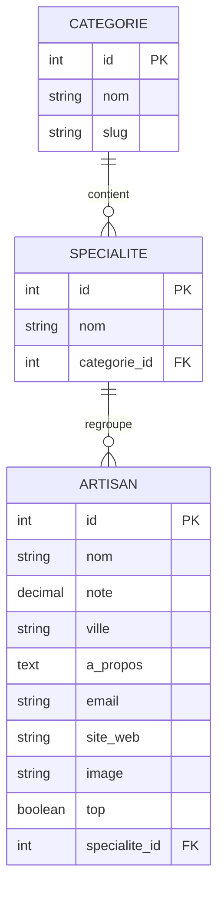

# Dossier final - Trouve ton artisan

## Page de garde

**Trouve ton artisan**  
Conception et développement d'une plateforme régionale  
Candidat : Simon CLEMENT - Date : 19 août 2026

## Sommaire

1. Contexte et besoins
2. Contraintes et livrables
3. Conception UX/UI et maquettes
4. Base de données
5. Architecture et fonctionnalités
6. Accessibilité, SEO et qualité
7. Sécurité
8. Veille sécurité
9. Liens du projet

## 1. Contexte et besoins

La Région Auvergne-Rhône-Alpes regroupe 12 départements et possède notamment une antenne à Lyon. Près d'un tiers de ses entreprises relèvent de l'artisanat. La Région souhaite faciliter la mise en relation entre particuliers et artisans locaux grâce à une plateforme simple et accessible.

Le besoin principal est de permettre à un particulier de choisir une catégorie, consulter les artisans correspondants, rechercher un artisan par son nom, ouvrir sa fiche détaillée puis lui envoyer une demande de renseignement, de prestation ou de tarif.

## 2. Contraintes et livrables

- Interface ReactJS, Bootstrap et Sass, conçue mobile-first.
- API Node.js/Express avec Sequelize et base MySQL/MariaDB.
- Catégories, spécialités et artisans alimentés dynamiquement par la base.
- Conformité visée WCAG 2.1, validation W3C, sécurité et référencement.
- Code versionné avec Git/GitHub et site hébergé.
- Deux scripts SQL distincts : création et alimentation.
- README d'installation et de lancement.

## 3. Conception UX/UI et maquettes

Les écrans à présenter en mobile, tablette et ordinateur sont : accueil, liste par catégorie, résultats de recherche, fiche artisan avec formulaire, pages légales et page 404. Le parcours privilégie de gros contrôles, des libellés explicites, une hiérarchie visuelle courte et un contraste élevé.

**Lien Figma :** https://www.figma.com/design/ihplUL3iLSQAA9iLKhdYzA/Sans-titre?node-id=2-2

Les maquettes présentent les principaux écrans et leurs déclinaisons responsive.

## 4. Base de données

### MCD

Règles de gestion : une catégorie contient zéro à plusieurs spécialités ; une spécialité appartient à une seule catégorie ; une spécialité regroupe zéro à plusieurs artisans ; un artisan appartient à une seule spécialité.

### MLD

- `CATEGORIES(id PK, name UQ, slug UQ)`
- `SPECIALTIES(id PK, name UQ, category_id FK → CATEGORIES.id)`
- `ARTISANS(id PK, name, rating, city, about, email, website, image, is_top, specialty_id FK → SPECIALTIES.id)`

Les clés étrangères assurent l'intégrité référentielle. Les index sur le nom, la spécialité et l'indicateur « artisan du mois » accélèrent les requêtes fréquentes.

## 5. Architecture et fonctionnalités

Le navigateur appelle uniquement l'API REST. L'API valide la requête, interroge MySQL avec Sequelize et renvoie du JSON. Les adresses e-mail des artisans ne sont jamais renvoyées au frontend. En production, l'API transmet les messages avec le relais SMTP de Brevo.

Routes principales : `GET /api/categories`, `GET /api/artisans`, `GET /api/artisans/:id`, `POST /api/artisans/:id/contact` et `GET /api/health`.

## 6. Accessibilité, SEO et qualité

- Langue française déclarée et lien d'évitement vers le contenu.
- Structure sémantique (`header`, `nav`, `main`, `section`, `article`, `footer`).
- Navigation au clavier, focus visible, libellés de formulaire et messages annoncés.
- Contrastes renforcés, tailles adaptatives, aucun sens transmis par la couleur seule.
- Titres et descriptions spécifiques aux pages ; routes lisibles.
- Mise en page mobile-first avec paliers tablette et ordinateur.
- Build de production et tests d'API automatisés.

## 7. Sécurité

- **CORS restreint** : seule l'origine déclarée du frontend peut appeler l'API depuis un navigateur.
- **Helmet** : ajoute des en-têtes HTTP défensifs (CSP, anti-sniffing et politiques associées).
- **Limitation de débit** : protège l'API et limite le formulaire à cinq envois par heure et par adresse IP.
- **Validation serveur** : types, longueurs et formats sont vérifiés ; une limite de 20 Ko s'applique au JSON.
- **Requêtes paramétrées** : Sequelize sépare données et requêtes, réduisant le risque d'injection SQL.
- **Anti-spam** : champ leurre invisible et limitation dédiée au contact.
- **Confidentialité** : l'e-mail de l'artisan est exclu des réponses API.
- **Erreurs neutres** : aucune trace technique ou donnée sensible n'est retournée au client.
- **Secrets hors Git** : configuration via `.env`, exclue du dépôt ; exemple sans secret fourni.
- **Dépendances** : audit régulier, mises à jour maîtrisées et tests avant livraison.
- **Transport** : HTTPS obligatoire en production ; compte SQL à privilèges minimaux et sauvegardes contrôlées.

## 8. Veille sécurité

La veille s'appuie sur OWASP Top 10, OWASP Cheat Sheet Series, les avis GitHub et la base CVE/NVD. Une revue est réalisée avant chaque livraison : `npm audit`, lecture des avis concernant Express, Sequelize, Vite et leurs dépendances, classement par exploitabilité puis correction ou mesure compensatoire documentée.

Vulnérabilités particulièrement surveillées : injection, contrôle d'accès défaillant, configuration incorrecte, XSS, SSRF, composants obsolètes et abus du formulaire. Dans ce projet, Sequelize et la validation réduisent l'injection, l'échappement React limite le XSS, Helmet durcit la configuration et la limitation de débit réduit l'automatisation abusive.

Audit du 19 août 2026 : aucune alerte sur le frontend. Les versions de Nodemailer et Vitest ont été mises à jour. Une alerte modérée reste présente dans une dépendance interne de Sequelize (`uuid`) ; les fonctions concernées ne sont pas utilisées directement par le projet et aucune mise à jour compatible de Sequelize ne la corrige actuellement.

Sources de veille : https://owasp.org/www-project-top-ten/ ; https://cheatsheetseries.owasp.org/ ; https://github.com/advisories ; https://nvd.nist.gov/

## 9. Liens du projet

- Repository GitHub : https://github.com/KiozTwo/Devoir-Trouve-ton-artisan
- Maquettes Figma : https://www.figma.com/design/ihplUL3iLSQAA9iLKhdYzA/Sans-titre?node-id=2-2
- Site en ligne : https://trouve-ton-artisan-frontend-t6xv.onrender.com
- API : https://trouve-ton-artisan-api-sdm4.onrender.com

## Conclusion

La solution couvre le parcours attendu, sépare clairement frontend, API et données, et fournit une base maintenable pour l'alimentation future par une autre application.

