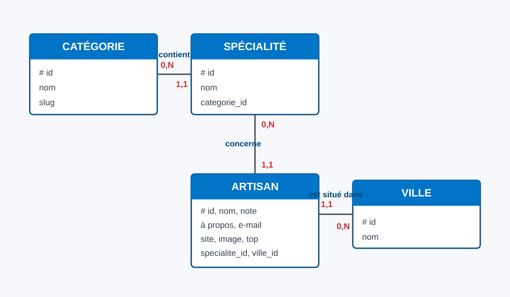

# MCD et MLD

## Modèle conceptuel de données

### Règles de gestion

- Une catégorie contient zéro ou plusieurs spécialités.
- Une spécialité appartient à une seule catégorie.
- Une spécialité concerne zéro ou plusieurs artisans.
- Un artisan possède une seule spécialité.
- Une ville regroupe zéro ou plusieurs artisans.
- Un artisan est installé dans une seule ville.

## Modèle logique de données

- `CATEGORIES(id PK, name UQ, slug UQ)`
- `SPECIALTIES(id PK, name UQ, category_id FK → CATEGORIES.id)`
- `CITIES(id PK, name UQ)`
- `ARTISANS(id PK, name, rating, about, email, website, image, is_top, specialty_id FK → SPECIALTIES.id, city_id FK → CITIES.id)`

Les clés étrangères empêchent l’enregistrement d’un artisan avec une spécialité ou une ville inexistante.
