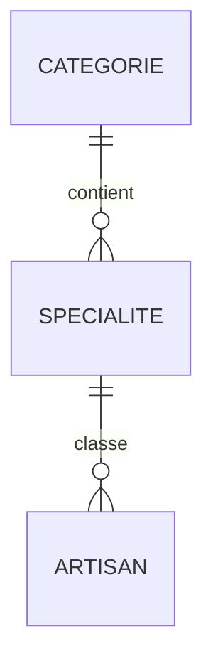

# MCD / MLD

## MCD

Cardinalités : un artisan a exactement une spécialité ; une spécialité a exactement une catégorie. Une catégorie ou spécialité peut n'avoir encore aucun artisan.

## MLD

`CATEGORIES(#id, name, slug)`  
`SPECIALTIES(#id, name, category_id → CATEGORIES.id)`  
`ARTISANS(#id, name, rating, city, about, email, website, image, is_top, specialty_id → SPECIALTIES.id)`
